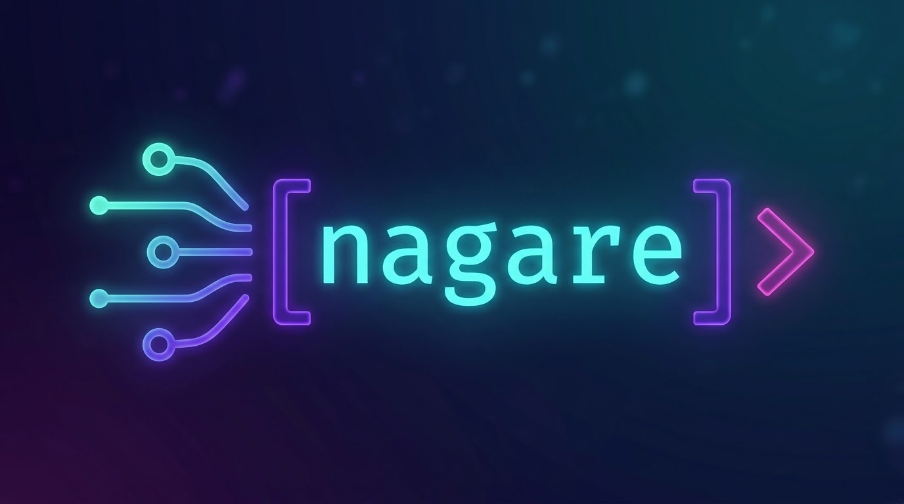
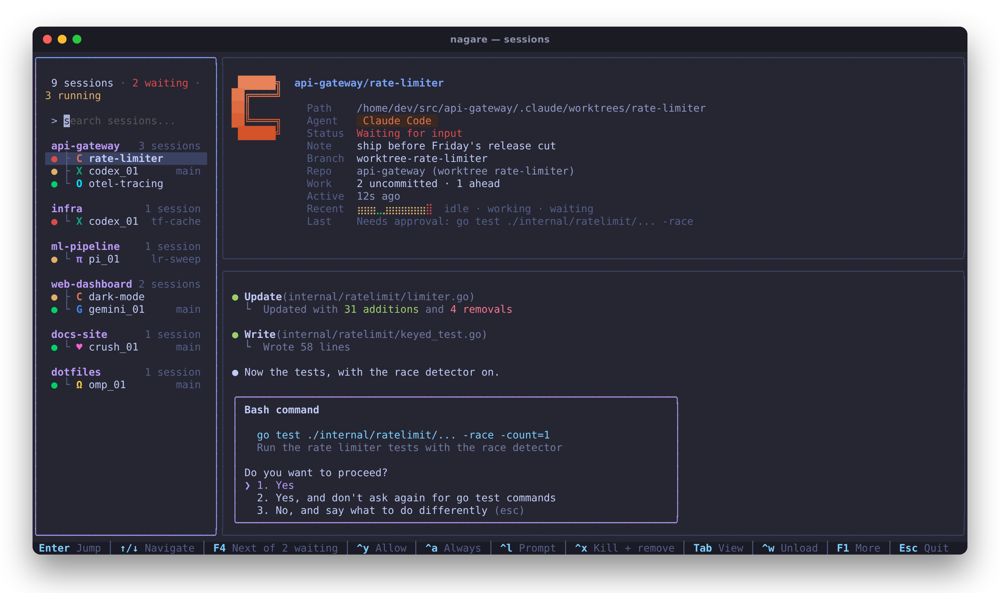
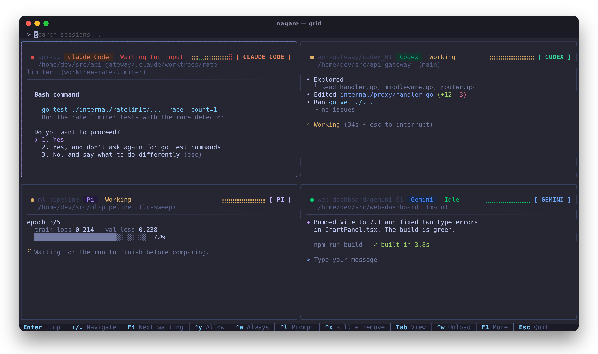
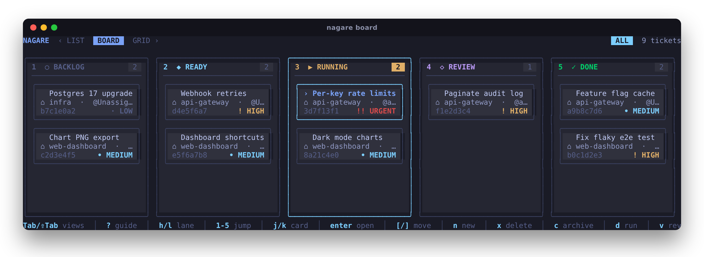
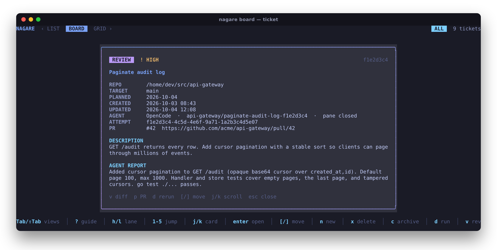
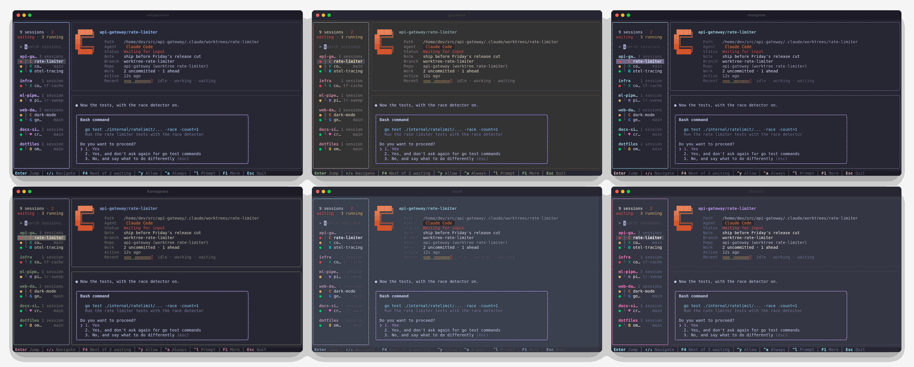
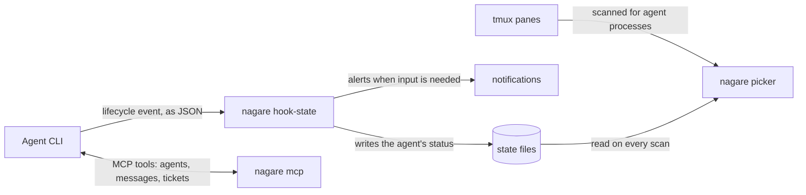

<p align="center">
  
</p>

<p align="center">
  <b>One place to watch, switch between, and steer every AI coding agent you run in tmux.</b><br>
  Claude Code · Codex · Gemini CLI · OpenCode · Crush · pi · OhMyPi
</p>

<p align="center">
  <a href="https://github.com/nmicovic/nagare/actions/workflows/ci.yml"></a>
  
  
  
  
</p>

<p align="center">
  <a href="#features">Features</a> ·
  <a href="#install">Install</a> ·
  <a href="#setup">Setup</a> ·
  <a href="#usage">Usage</a> ·
  <a href="#ticket-workflow">Ticket workflow</a> ·
  <a href="#how-it-works">How it works</a> ·
  <a href="#configuration">Configuration</a>
</p>

<p align="center">
  
</p>

Run five agents across three repositories and the hard part stops being the code —
it is noticing which agent has been sitting on a permission prompt for ten minutes.
**nagare** (流れ, *flow*) is a single binary that sits in a tmux popup and answers
that at a glance: every agent, what it is doing, what it last said, and which ones
are waiting on you.

## Features

- **Session picker** — every agent pane in every tmux session, grouped by repository,
  with fuzzy search, a live preview, and status reported by the agents' own hooks
  wherever they offer them.
- **Act without switching** — approve a permission prompt (<kbd>Ctrl</kbd>+<kbd>y</kbd>),
  send a prompt (<kbd>Ctrl</kbd>+<kbd>l</kbd>), or jump to the next agent waiting on you
  (<kbd>F4</kbd>).
- **Worktree aware** — agents in different git worktrees of one repo get their own
  name, branch and outstanding-work summary. <kbd>F3</kbd> starts an agent in a fresh worktree.
- **Ticket board** — plan work across projects, then hand a ticket to any agent. Each
  attempt runs on its own branch in an isolated worktree; review the diff and open the
  pull request from the board.
- **Notifications** — toast, terminal bell, desktop notification or popup when an agent
  needs input or finishes a long task.
- **Agent-to-agent messaging** — an MCP (Model Context Protocol) server lets agents
  discover each other, exchange messages, and pick up tickets.
- **13 themes**, mouse support, and a grid view for watching everything at once.

### Grid view

Press <kbd>Tab</kbd> to cycle list → board → grid. The grid shows every agent's live output
side by side.

<p align="center">
  
</p>

### Ticket board

Tickets move from Backlog to Done. Pressing <kbd>d</kbd> on a ready ticket picks an agent
(and optionally a model), pins the target branch to a commit, and starts the agent in a
worktree nagare owns, so your own checkout is never touched.

<p align="center">
  
</p>

Pressing <kbd>Enter</kbd> opens a ticket: its description, the agent working on it, the attempt
record, the pull request, and the report the agent submitted when it finished.

<p align="center">
  
</p>

### Themes

Tokyo Night (default), Aura, Catppuccin, Dracula, Flexoki, Gruvbox, Kanagawa, Monokai,
Nord, One Dark, One Dark Pro, Rosé Pine and Vesper. Each has a light and a dark variant
that follows your terminal's background, and <kbd>Ctrl</kbd>+<kbd>t</kbd> previews them live.

<p align="center">
  
</p>

## Requirements

- **Linux or WSL2.** On macOS, agents that run as their own binary are detected, but
  ones started through Node are found by walking `/proc`, which macOS does not have.
- **tmux 3.3** or newer.
- **Go 1.26** or newer, to build.
- **git**, and optionally the [GitHub CLI](https://cli.github.com/) (`gh`) for creating
  pull requests from the board.

## Install

```bash
git clone https://github.com/nmicovic/nagare.git
cd nagare
go install .        # installs `nagare` into $(go env GOPATH)/bin
```

Make sure `$(go env GOPATH)/bin` is on your `PATH`. Alternatively, `./compile.bash`
builds a stripped binary in the repository directory.

## Setup

```bash
nagare setup
```

This wires nagare into every supported agent it finds. Re-running it is safe: generated
files are rewritten in place and every registration is refreshed.

| Agent | Status reporting | Messaging tools |
|---|---|---|
| Claude Code | hooks in `~/.claude/settings.json` | MCP, `~/.claude.json` |
| Codex | hooks in `~/.codex/hooks.json` | MCP, `~/.codex/config.toml` |
| Gemini CLI | hooks in `~/.gemini/settings.json` | MCP, `~/.gemini/settings.json` |
| OpenCode | plugin in `~/.config/opencode/plugins/` | MCP, `~/.config/opencode/opencode.json` |
| Crush | read from the pane | MCP, `~/.config/crush/crush.json` |
| pi | extension in `~/.pi/agent/extensions/` | the same tools through `nagare tool` (pi has no MCP client) |
| OhMyPi | extension in `~/.omp/agent/extensions/` | MCP, `~/.omp/agent/mcp.json` |

It also installs the `/nagare-ls`, `/nagare-send`, `/nagare-send-wait` and
`/nagare-inbox` slash commands, or an Agent Skill for agents without user-level
slash commands (Codex, Crush).

> [!NOTE]
> Codex does not run newly installed hooks until you approve them. Open `/hooks` in
> Codex once after setup and trust the nagare hooks.

Then bind nagare to tmux popups in `~/.tmux.conf`:

```tmux
bind g display-popup -w100% -h100% -B -E "nagare"          # prefix + g: picker
bind b display-popup -w100% -h100% -B -E "nagare board"    # prefix + b: ticket board
bind e display-popup -w80%  -h80%     -E "nagare notifs"   # prefix + e: notifications
```

and reload with `tmux source-file ~/.tmux.conf`.

## Usage

```bash
nagare                          # session picker (default)
nagare board                    # cross-project ticket board
nagare notifs                   # notification history and settings
nagare new ~/src/api            # new tmux session running Claude Code in ~/src/api
nagare new ~/src/api -a codex   # …or any other agent: codex, opencode, gemini, crush, pi, omp
nagare new ~/src/api -w retry   # start the agent in a new git worktree named "retry"
nagare new scratch              # quick prototype in ~/Prototypes/scratch
nagare setup                    # install status reporting, MCP server and slash commands
```

### Picker keys

| Key | Action | | Key | Action |
|---|---|---|---|---|
| Type | Fuzzy search by name or path | | <kbd>Ctrl</kbd>+<kbd>y</kbd> | Approve the permission prompt |
| <kbd>↑</kbd> <kbd>↓</kbd> | Move the selection | | <kbd>Ctrl</kbd>+<kbd>a</kbd> | Approve always |
| <kbd>Enter</kbd> | Jump to the agent | | <kbd>Ctrl</kbd>+<kbd>l</kbd> | Send a prompt inline |
| <kbd>F4</kbd> | Next agent waiting on you | | <kbd>Ctrl</kbd>+<kbd>g</kbd> | Write a prompt in `$EDITOR` |
| <kbd>Tab</kbd> / <kbd>Shift</kbd>+<kbd>Tab</kbd> | Cycle list, board and grid | | <kbd>Ctrl</kbd>+<kbd>n</kbd> | New session |
| <kbd>Ctrl</kbd>+<kbd>t</kbd> | Pick a theme | | <kbd>Ctrl</kbd>+<kbd>r</kbd> | Quick prototype |
| <kbd>Ctrl</kbd>+<kbd>s</kbd> | Show saved sessions | | <kbd>F2</kbd> | Name the selected task |
| <kbd>Ctrl</kbd>+<kbd>o</kbd> | Cycle sort order | | <kbd>F3</kbd> | New git worktree |
| <kbd>Ctrl</kbd>+<kbd>f</kbd> | Star a session | | <kbd>F5</kbd> | Edit the session note |
| <kbd>Ctrl</kbd>+<kbd>e</kbd> | Edit the config file | | <kbd>Ctrl</kbd>+<kbd>w</kbd> | Unload the agent (close its pane) |
| <kbd>F1</kbd> | All shortcuts | | <kbd>Ctrl</kbd>+<kbd>x</kbd> | Kill the agent's window; offers to remove its worktree |
| <kbd>Esc</kbd> | Quit | | | |

Mouse: click to select, click again to jump, scroll to move. Turn it off with
`picker.mouse = false`.

### Board keys

| Key | Action | | Key | Action |
|---|---|---|---|---|
| <kbd>h</kbd> <kbd>l</kbd> / <kbd>←</kbd> <kbd>→</kbd> | Move between lanes | | <kbd>d</kbd> | Run the ticket with an agent |
| <kbd>1</kbd>–<kbd>5</kbd> | Jump to a lane | | <kbd>v</kbd> | Review the attempt's diff |
| <kbd>j</kbd> <kbd>k</kbd> / <kbd>↑</kbd> <kbd>↓</kbd> | Select a ticket | | <kbd>p</kbd> | Push the branch and open a pull request |
| <kbd>Enter</kbd> | Open the ticket | | <kbd>c</kbd> | Archive a finished ticket's worktree |
| <kbd>n</kbd> / <kbd>e</kbd> | New / edit ticket | | <kbd>a</kbd> | Show available agents |
| <kbd>[</kbd> <kbd>]</kbd> | Move ticket left / right | | <kbd>t</kbd> | Toggle Today / All |
| <kbd>x</kbd> | Delete ticket | | <kbd>?</kbd> | Built-in guide to the workflow |
| <kbd>q</kbd> / <kbd>Esc</kbd> | Quit | | | |

## Ticket workflow

1. **Plan.** Create a ticket with a repository and a target branch.
2. **Isolate.** <kbd>d</kbd> resolves the target branch to a fixed commit, creates the
   branch `nagare/<ticket>-<attempt>` and a worktree under
   `~/.local/share/nagare/workspaces/`, starts the agent there, and hands it the ticket.
   Your checkout and the target branch are never modified.
3. **Review.** When the agent calls `submit_ticket`, the ticket moves to Review.
   Press <kbd>v</kbd> to see the commits and the full diff against the base commit.
4. **Finish.** <kbd>p</kbd> pushes the branch (never with `--force`) and creates the
   pull request with `gh` — or finds the existing one if a previous attempt was
   interrupted. Once merged, move the ticket to Done, close the agent, and <kbd>c</kbd>
   removes the worktree. Uncommitted work blocks removal, and the branch is always kept.

Every attempt is recorded on disk — base commit, branch, agent, model, pull request —
so a retry never overwrites what the previous one did.

## How it works



Agents report their own state through hooks, plugins or extensions, so a status is a
fact, not a guess from screen text. The picker matches those reports to tmux panes
and adds what tmux knows: path, branch, worktree, and a preview of the pane.

## Configuration

`~/.config/nagare/config.toml` (<kbd>Ctrl</kbd>+<kbd>e</kbd> opens it). Every key is
optional; these are the defaults.

```toml
[appearance]
theme = "tokyonight"

[picker]
show_help_bar = true
mouse = true
animations = true
quick_project_path = "~/Prototypes"

[notifications]
enabled = true

[notifications.needs_input]
toast = true
bell = true
os_notify = true
popup = false

[notifications.task_complete]
toast = true
min_working_seconds = 30   # only notify for tasks that ran at least this long
```

State lives in `~/.local/share/nagare/`: agent status, notifications, messages,
tickets, attempt records and the managed worktrees.

## Development

```bash
go build -o nagare .   # debug build
go test ./...          # run the test suite
go vet ./...
```

Issues and pull requests are welcome.

Built with [Bubble Tea](https://github.com/charmbracelet/bubbletea),
[Lip Gloss](https://github.com/charmbracelet/lipgloss) and
[Cobra](https://github.com/spf13/cobra).

## License

[MIT](LICENSE) © 2026 Nemanja Mićović
